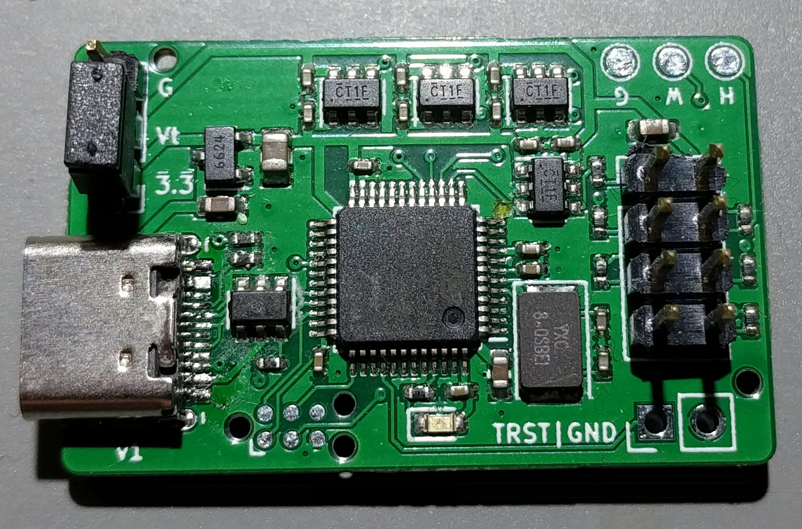
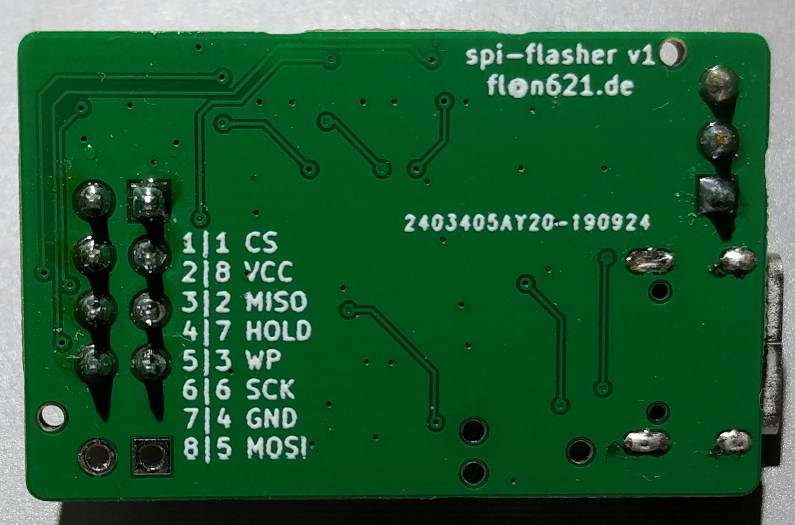

# spi-flasher

This repository contains an USB-C-to-SPI-flash adapter that is compatible with
[stm32-vserprog](https://github.com/dword1511/stm32-vserprog/) and also has
integrated level-shifters towards the SPI flash. This was created mainly to try
out the JLCPCB assembly service and because there is no convenient way to
program 1.8V flash chips with the "Bluepill + mess of wires" setup I was using
before. The pinout is arranged such that it matches the common flash test
clips.

Furthermore, there is a simple breakout board that flash chips can be directly
soldered onto if space in the target device is too tight to use such a clip
(this is mainly useful when reverse-engineering third-party hardware).

## Hardware

The respective `fab` directories contain fabrication data (and in the case of
the adapter, JLCPCB-style assembly data) for the boards. As JLCPCB cannot
populate connectors at this time, those had to be assembled manually:

 - The dual-row 100mil connector is either a plain dual-row header or a
   shrouded/keyed one.
 - The USB-C connector is a particular family that I sourced from
   [AliExpress](https://aliexpress.com/item/32822609480.html). There doesn't
   seem to be alternative from western distributors that's similarly convenient
   to solder.

The way the target is powered can be selected through the pin header above the
USB port: The target can be self-powered (no jumper), powered from the internal
3.3V rail (jumper between 3.3 and Vt) or powered externally (supply power
between G and Vt).

The TRST/GND connector was meant as an extension that could be used (given a
modified version of `stm32-vserprog`) to keep a target device in reset while
accessing the flash to prevent interference. However, this does not really work
out mechanically, so it was never used.

## Firmware

Build `stm32-vserprog` using `BOARD=stm32-jz01v20` and flash the firmware via
the TagConnect connector.
